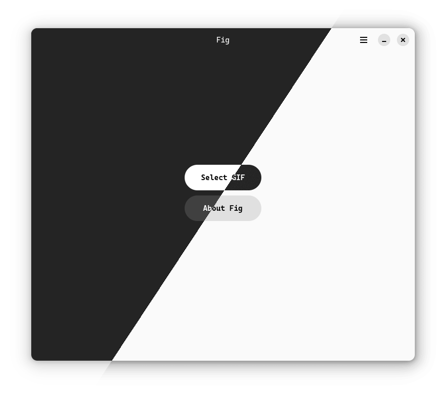
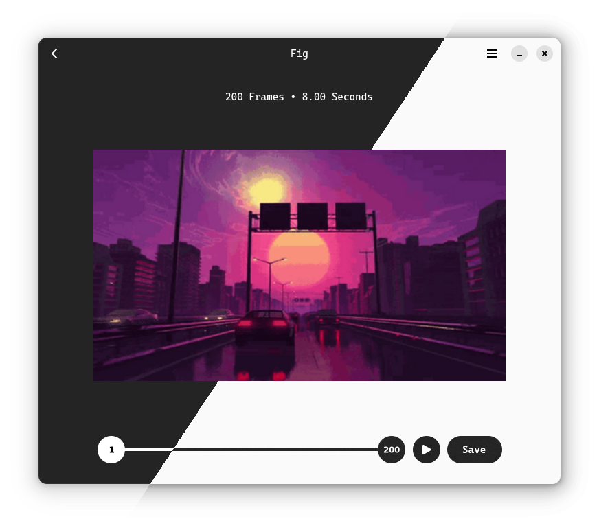

<h1 align="center" style="border-bottom: none;">
  
   
  Fig
</h1>
<h4 align="center">Sleek GIF editor.</h4>

  

## Features

- Trim GIF to any frame range
- Reverse GIF
- Remove specific frames
- Insert GIF/image(s) at any position
- Change playback speed for specific frames
- Play GIF at the original speed

> **Tip: right click on the handles to discover more**

## Build and Run

- Run as python module:

  `python -m fig.main`

- Flatpak:

  - Build and install

    `flatpak run org.flatpak.Builder --force-clean --sandbox --user --install --install-deps-from=flathub --ccache --mirror-screenshots-url=https://dl.flathub.org/media/ --repo=repo builddir io.github.Q1CHENL.fig.json`

  - Run

    `flatpak run io.github.Q1CHENL.fig`

## Test

`pip install pytest`

`pytest tests/test_editor.py`

## Todos

- ~~Improve UI~~
- ~~Previews frames~~
- ~~Preview trimmed gif~~
- Crop GIF
- ~~Export frame(s)~~
- Combine frames to GIF
- ~~Stop icon for the play button~~
- ~~Reverse GIF: switch handles~~
- ~~Port to GTK4~~
- Capture GIF
- Web version of Fig
- ~~Make GIF slower/faster~~
- Make GIF black-and-white
- ~~Reverse playback~~
- ~~Append/Insert/Remove frames in frameline~~
- ~~Design GTK-Style icon~~
- ~~Button and handles hover effects~~
- Load GIF faster
- ~~Improve tests and solve warnings~~
- ~~Use FileDialog instead of FileChooserDialog/Native(GTK-4.10)~~
- ~~Light mode~~
- Undo last action
- Proper default name for edited GIF when saving
- Menu in headerbar: ~~new window~~, open, ~~help~~ etc.
- ~~New About page~~
- Better info label UI
- Loop playback option
- Light/Dark mode screenshots
- Preferences: fixed color mode, default save folder etc.

## Notice

- Homepage UI is inspired by [sly](https://github.com/kra-mo/sly)

## Contribute

PRs and Issues are always welcome.
