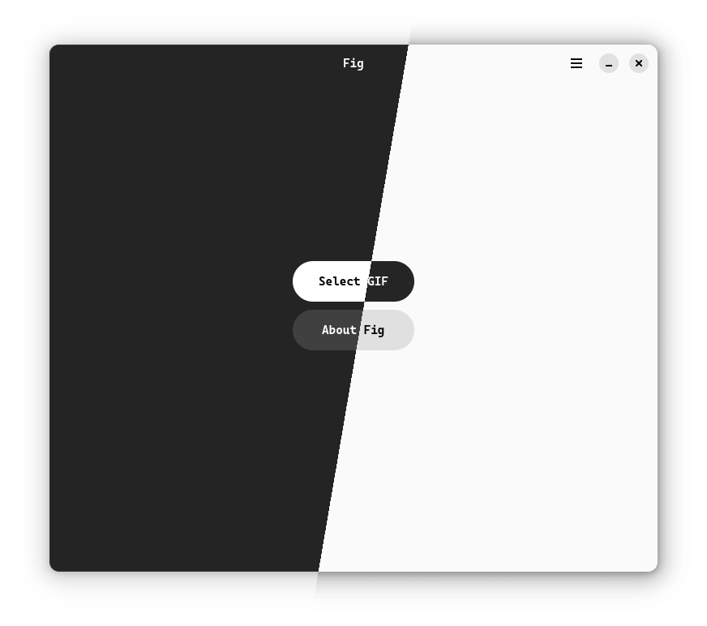
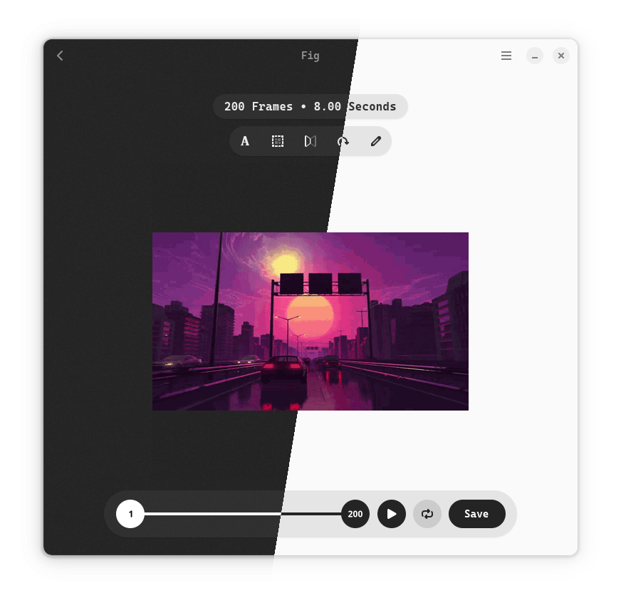

<h1 align="center" style="border-bottom: none;">
  
   
  Fig
</h1>
<h4 align="center">Sleek GIF editor.</h4>

  

## Features

- Crop, flip and rotate GIF
- Trim GIF to any frame range
- Reverse GIF
- Remove specific frames
- Insert GIF/image(s) at any position
- Change playback speed for specific frames
- Duplicate frame range
- Extract frames
- Export GIF as video
- Play GIF at the original speed
- Text embedding
- Draw on gif

> [!TIP]
> View the Help page for more advanced actions

## Build and Run

- Run as python module:

  `pip install -r requirements.txt` (Install dependencies)

  `python -m fig`

  - Install stubs for better code completion (optional)

    `pip install pygobject-stubs`

- Flatpak:

  - Build and install

    `flatpak run org.flatpak.Builder --force-clean --sandbox --user --install --install-deps-from=flathub --ccache --mirror-screenshots-url=https://dl.flathub.org/media/ --repo=repo builddir io.github.Q1CHENL.fig.json`

  - Run

    `flatpak run io.github.Q1CHENL.fig`

## Test

`pip install pytest`

`pytest test/test.py`

## Credits

- Homepage UI is inspired by [sly](https://github.com/kra-mo/sly)

## Contribute

PRs and Issues are always welcome.
