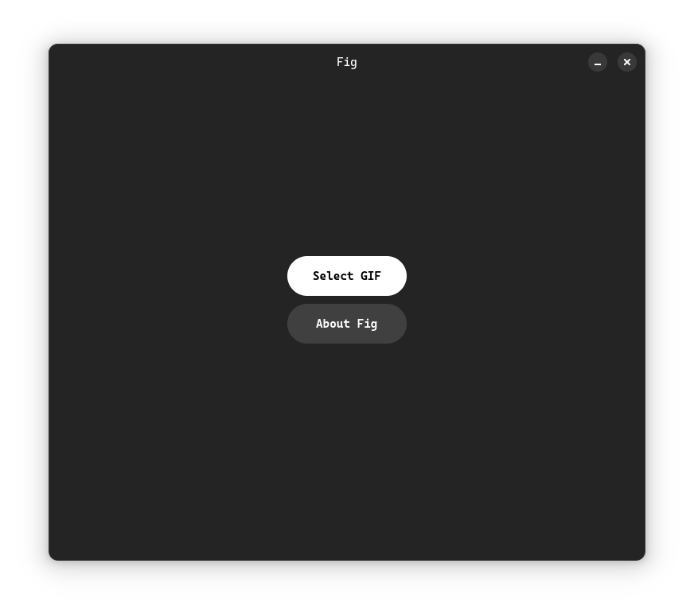
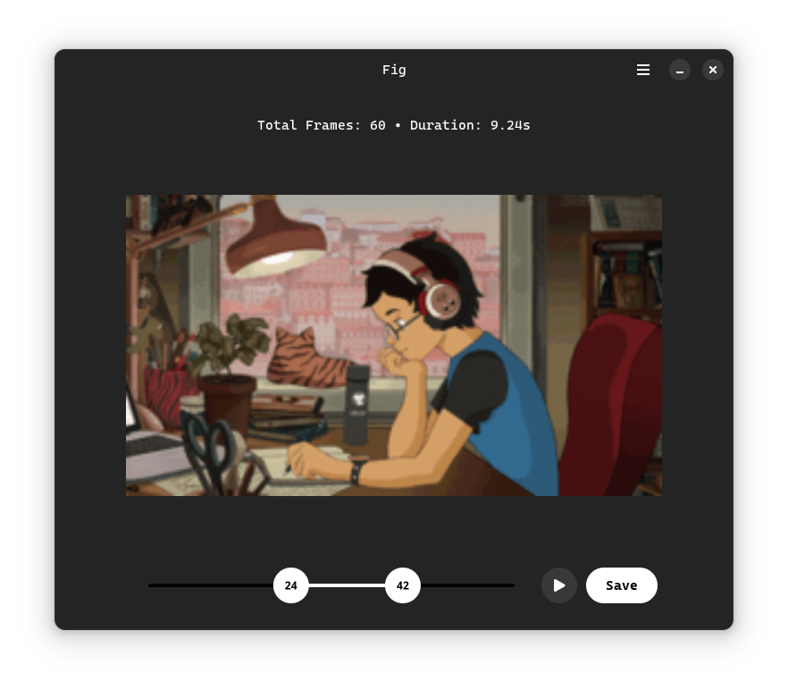

<h1 align="center" style="border-bottom: none;">
  
   
  Fig
</h1>
<h4 align="center">Sleek GIF editor.</h4>

  

## Todos

- ~~Improve UI~~
- ~~Previews frames~~
- ~~Preview trimmed gif~~
- Crop GIF
- ~~Export frame(s)~~
- Combine frames to GIF
- ~~Stop icon for the play button~~
- ~~Reverse GIF: switch handles~~
- ~~Port to GTK4~~
- Capture GIF
- Web version of Fig
- Make GIF slower/faster
- Make GIF black-and-white
- ~~Reverse playback~~
- Append/Insert/Remove frames in frameline
- ~~Design GTK-Style icon~~
- ~~Button and handles hover effects~~
- Load GIF faster
- Improve tests and solve warnings
- ~~Use FileDialog instead of FileChooserDialog/Native(GTK-4.10)~~
- Select new in editor

## Test

`pytest tests/test_editor.py`

## Notice

- Homepage UI is inspired by [sly](https://github.com/kra-mo/sly)

## Contribute

PRs and Issues are always welcome.
